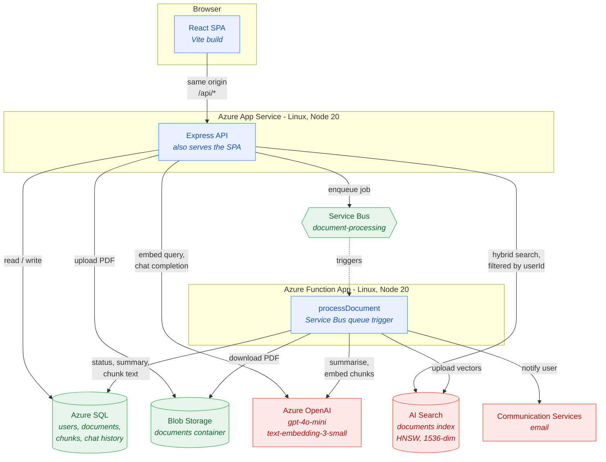
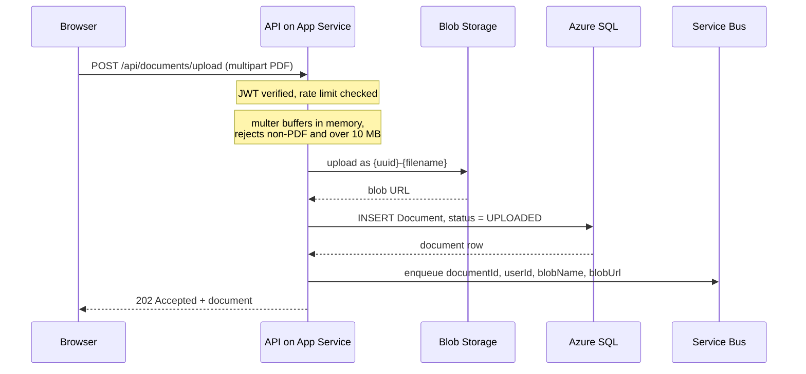
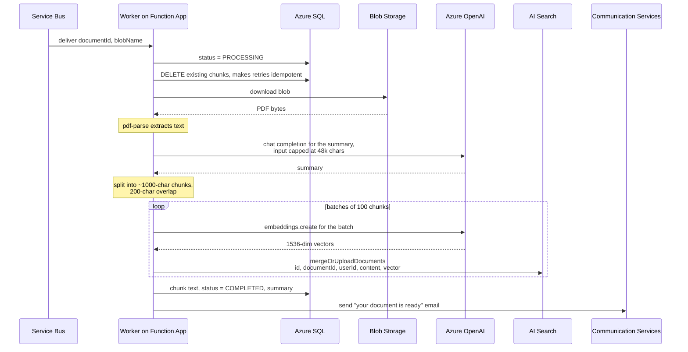
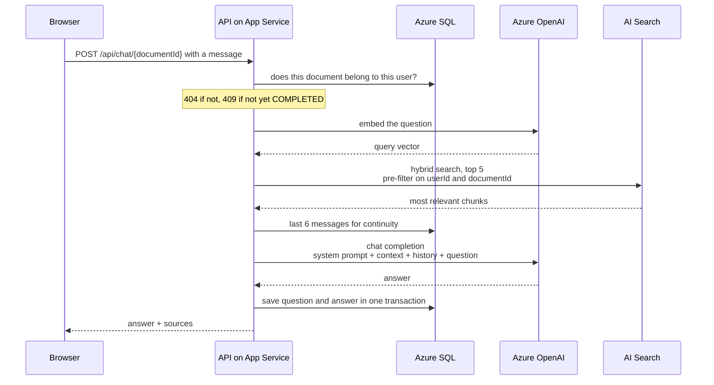
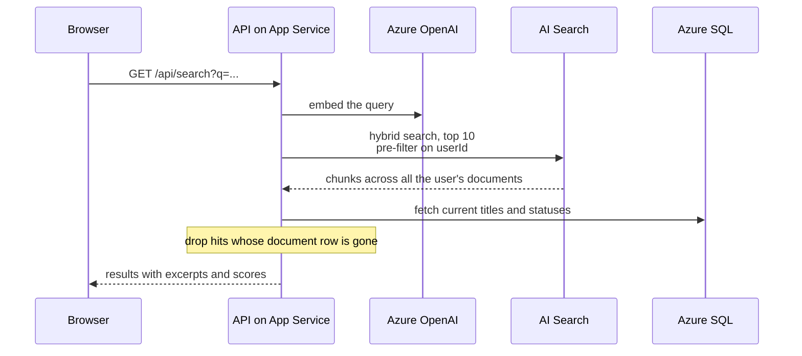

# DocuMind AI

Upload a PDF, and DocuMind extracts its text, summarises it, and makes it
searchable and conversational. Ask questions in plain language and get answers
grounded in your own documents.

Built on Azure as an event-driven pipeline: uploads return immediately, and the
slow work (parsing, summarising, embedding, indexing) happens in a background
worker.

- **[Architecture](#architecture)** - how the pieces fit together
- **[How it works in Azure](#how-it-works-in-azure)** - every flow, step by step
- **[Azure resources](#azure-resources)** - what each service does and why
- **[Configuration](#configuration)** - where settings and secrets live
- **[Running locally](#running-locally)**
- **[Deploying](#deploying)**
- **[Operations](#operations)** - health, failures, logs
- **[Security](#security)**

---

## Architecture



### Two design decisions worth knowing

**The API also serves the web UI.** The built SPA is packaged inside the API
deployment and served by Express from the same App Service, so one App Service
hosts the whole application. This is not only a cost saving: because the UI and
API share an origin, there is no CORS allow-list to maintain, and the frontend
uses relative URLs instead of having the API hostname compiled into its bundle.

**Uploads are asynchronous.** The API stores the file and returns `202 Accepted`
in well under a second. Parsing a PDF, calling a language model and indexing
vectors can take a minute or more, which is far too long for an HTTP request. A
Service Bus queue decouples the two, so a slow or failing document never blocks
the API, and a burst of uploads queues up instead of overwhelming it.

---

## How it works in Azure

### Flow 1: uploading a document



Details that matter:

- **Nothing touches the container filesystem.** `multer` uses `memoryStorage`,
  because App Service instances are ephemeral and their disks are small. The
  10 MB limit bounds how much memory a single request can consume.
- **Blob names are sanitised.** The original filename is stripped of directory
  components and unsafe characters, then prefixed with a UUID, so two uploads of
  `report.pdf` cannot collide.
- **The queue message carries `messageId = documentId`,** so a retried publish is
  collapsed instead of processing the same document twice.
- **Failures do not leave debris.** If the database insert fails, the orphaned
  blob is deleted. If the enqueue fails, the document is marked `FAILED` with an
  explanatory message rather than sitting in `UPLOADED` forever with no clue why.

### Flow 2: background processing

This is where the real work happens. Service Bus delivers the message and the
Function App wakes up.



Details that matter:

- **The document status is the source of truth:** `UPLOADED` to `PROCESSING` to
  `COMPLETED`, or `FAILED` with the reason stored in `Document.errorMessage` so
  the UI can explain what went wrong.
- **Embeddings are batched.** One API call per 100 chunks rather than one per
  chunk. On a large PDF that is the difference between a few requests and several
  hundred, which matters for both latency and Azure OpenAI rate limits.
- **The summary input is capped** at roughly 48,000 characters. Sending an entire
  long document would exceed the model's context window and fail the whole job.
- **Reprocessing is safe.** Existing chunks are deleted first, and search
  documents use the deterministic key `{documentId}-{chunkIndex}`, so a replay
  overwrites instead of duplicating.
- **`userId` is written into the search index.** This is what makes tenant
  isolation possible at query time, see Flow 3.
- **Email is best-effort and last.** A notification failure is logged but never
  fails the job, because the document has already been processed successfully.

**When something goes wrong,** the worker records the reason on the document and
then rethrows. Rethrowing is deliberate: it lets Service Bus retry the message,
and after 5 delivery attempts the message lands in the dead-letter queue where it
can be inspected. Swallowing the error would mean silent data loss with no
alertable signal.

### Flow 3: chatting with a document (RAG)



Details that matter:

- **Ownership is checked before any paid API call.** No embedding is generated for
  a document the caller cannot see.
- **Search is hybrid:** BM25 keyword scoring combined with vector similarity, so
  both exact terminology and paraphrased questions retrieve well.
- **The filter is a pre-filter.** Azure AI Search applies the `userId` filter
  *before* the nearest-neighbour search, so the candidate set only ever contains
  the caller's own chunks. Filtering afterwards would both pull other tenants'
  text into the process and silently return nothing when their chunks dominated
  the top matches.
- **Context is bounded** to roughly 12,000 characters, so a long document cannot
  push the request past the model's token limit.
- **The prompt is context-bounded.** The model is instructed to answer only from
  the retrieved passages and to say so plainly when the answer is not there,
  rather than inventing one.
- **Question and answer are saved in a single transaction,** so the history can
  never contain a question without its answer.

### Flow 4: global search



The database stays authoritative for titles and statuses, because the search
index can lag behind renames and deletes.

---

## Azure resources

This is the deployed topology. Names follow the pattern
`<prefix>-documind-ai-<unique>`; substitute your own.

| Resource | Type | Role |
| :--- | :--- | :--- |
| `app-documind-ai-*` | App Service (Linux, Node 20) | Runs the Express API **and** serves the React SPA |
| `func-documind-ai-*` | Function App (Linux, Node 20) | `processDocument` worker, triggered by the queue |
| `asp-documind-ai-*` | App Service Plan (B1 Linux) | Shared compute for both of the above |
| `sqlc-documind-ai-*` / `sqldb-*` | Azure SQL | Users, documents, chunk text, conversations, messages, notifications, audit log |
| `st*` | Storage Account | The `documents` container holds uploaded PDFs; also backs the Functions runtime |
| `sb-documind-ai-*` | Service Bus | The `document-processing` queue decouples upload from processing |
| `search-documind-ai-*` | Azure AI Search | The `documents` index: vector and keyword search over chunks |
| Azure OpenAI / AI Foundry | Cognitive Services | `gpt-4o-mini` for summaries and answers, `text-embedding-3-small` for 1536-dim vectors |
| `comm-documind-ai-*` | Communication Services | The "your document is ready" email |
| Application Insights + Log Analytics | Monitoring | Traces, requests, dependencies, container logs |

### Why there are three data stores

This is the part that most often causes confusion. Each store has a distinct job:

- **Azure SQL** holds relational truth: who owns what, current status, chat
  history. It is what the UI reads.
- **Blob Storage** holds the original PDF bytes. Keeping them means a document can
  always be reprocessed from source after a model change or an index rebuild.
- **Azure AI Search** holds the embeddings and is the only thing that can answer
  "which passages are relevant to this question". Azure SQL has no native vector
  type in this schema, so vectors live here and nowhere else.

Chunk *text* is deliberately stored in both SQL and Search: in SQL so the app can
render a document without a search round-trip, and in Search so retrieval returns
the passage alongside its relevance score.

### The search index

Bicep can create the search *service*, but there is no ARM resource for an index
definition, so the REST API is the only way. `scripts/create-search-index.mjs`
owns it:

| Field | Type | Notes |
| :--- | :--- | :--- |
| `id` | String (key) | `{documentId}-{chunkIndex}`, deterministic so replays overwrite |
| `documentId` | String | filterable, scopes document chat |
| `userId` | String | filterable, **this is the tenant boundary** |
| `documentTitle` | String | searchable |
| `chunkIndex` | Int32 | filterable, sortable |
| `content` | String | searchable, the keyword half of hybrid search |
| `contentVector` | Collection(Single) | 1536 dims, HNSW, cosine, not retrievable |

Until this index exists, every upload fails at the indexing step and every query
returns 404. Run `npm run search:index` once per environment;
`npm run search:inspect` reports on the live index without changing it.

---

## Configuration

### The two arrangements

**Existing resources, no Key Vault.** Settings are pushed straight from your local
`.env` onto the App Service and Function App by `scripts/deploy-existing.ps1`.

**Greenfield, with Key Vault.** Bicep writes every secret to Key Vault, and both
apps read them through `@Microsoft.KeyVault(SecretUri=...)` references, authorised
by a system-assigned managed identity holding the Key Vault Secrets User role
scoped to the vault.

### Three settings that behave unusually

| Setting | Why it is special |
| :--- | :--- |
| `DATABASE_URL` | Prisma's `sqlserver` provider requires the JDBC-style `sqlserver://host:1433;database=...;encrypt=true` form. The ADO.NET form (`Server=tcp:...;Initial Catalog=...`) **will not parse**, and the API fails on its first query. |
| `VITE_API_URL` | Vite inlines `VITE_*` at **build time**, so an App Service application setting cannot change an already-built bundle. Leave it empty: the API serves the SPA, so relative URLs resolve correctly on their own. |
| `AzureWebJobsStorage` | Read by the Functions platform before app code runs. A Key Vault reference here is a known cause of "Azure Functions runtime is unreachable" on first boot, so it is set as a literal connection string. |

The API validates its whole environment at startup and **refuses to boot** if
`DATABASE_URL` is missing or `JWT_SECRET` is shorter than 32 characters. There is
no fallback signing key. In production it also requires the storage, Service Bus,
OpenAI and Search settings, so a half-configured deployment fails loudly instead
of looking healthy while every feature is broken.

`.env.example` documents the full list.

### Verifying configuration

```bash
npm run check:env       # keys present and well-formed; API and worker agree
npm run check:azure     # live calls to SQL, Blob, Service Bus, OpenAI, Search, ACS
```

`check:azure` makes real requests, including a small chat completion and an
embedding, so a pass means the app will genuinely work rather than merely compile.
Neither script ever prints keys or connection strings.

---

## Running locally

```bash
npm install
npm run prisma:generate
```

Create the config files from `.env.example`:

- `apps/backend/.env`
- `apps/functions/local.settings.json` (same keys, nested under `Values`)
- `apps/frontend/.env`

Then check them, apply the schema and create the index:

```bash
npm run check:env
npm run prisma:migrate --workspace=apps/backend
npm run search:index
```

Azure SQL blocks unknown IPs, so add your machine:

```bash
az sql server firewall-rule create \
  --resource-group rg-documind-ai --server <sql-server-name> \
  --name my-workstation \
  --start-ip-address "$(curl -s https://api.ipify.org)" \
  --end-ip-address "$(curl -s https://api.ipify.org)"
```

Three processes:

```bash
npm run dev --workspace=apps/backend     # API     -> http://localhost:4000
npm start  --workspace=apps/functions    # worker  (needs Azure Functions Core Tools)
npm run dev --workspace=apps/frontend    # web UI  -> http://localhost:5173
```

Leave `VITE_API_URL` empty and the Vite dev server proxies `/api` to the local
API, so the browser talks to a single origin and CORS never enters the picture. If
you do set it, use the **origin only** (`http://localhost:4000`), because every
call site already adds the `/api` prefix.

The worker talks to real Azure services even when run locally; there is no
emulator in this setup.

---

## Deploying

Two paths, both documented in **[DEPLOYMENT.md](./DEPLOYMENT.md)**.

**Onto resources that already exist.** Creates nothing:

```powershell
az login
./scripts/deploy-existing.ps1 -ResourceGroup rg-documind-ai -DryRun   # preview
./scripts/deploy-existing.ps1 -ResourceGroup rg-documind-ai
```

It resolves the App Service and Function App from the resource group, pushes
application settings from your local config, pins both to Node 20, packages the
API with the SPA inside it, deploys, then verifies.

**A fresh environment.** Bicep in `infra/` plus the GitHub Actions pipeline in
`.github/workflows/deploy.yml`, which runs
`validate` -> `infrastructure` -> `build` -> `provision` -> `deploy`. See
**[infra/README.md](./infra/README.md)**.

### Why deployment packages are built the way they are

npm workspaces hoist dependencies to the repo root, so `apps/backend/node_modules`
is nearly empty. Zipping the app folder would therefore ship an application with
no dependencies at all. Instead each package is staged in its own directory and
`npm install --omit=dev` runs *there*, followed by `prisma generate` so the client
lands in that tree. The Prisma schema declares Linux `binaryTargets`, so the query
engines Azure needs are included even when the package is built on Windows.

Both deployment paths verify more than "the upload succeeded":

- the API is polled on `/health/ready` until a real database round-trip succeeds
- `/dashboard` is fetched to prove deep links return the SPA shell rather than 404
- the Function App is queried for its function count, because a worker that throws
  while loading a module reports zero functions and otherwise looks exactly like a
  successful deploy

---

## Operations

### Health endpoints

| Endpoint | Checks | Used by |
| :--- | :--- | :--- |
| `GET /health` | Nothing. Returns 200 if the process is alive. | App Service health probe |
| `GET /health/ready` | `SELECT 1` against Azure SQL, plus which integrations are configured | CI smoke test, external monitors |

`/health` is dependency-free on purpose. Azure removes an instance that fails its
health check and replaces it, so wiring a database check into it would turn a
brief SQL outage into an endless instance-replacement loop.

A Basic-tier or serverless Azure SQL database parks when idle and can take 15+
seconds to accept its first connection, so the readiness probe allows 20 seconds
(`DB_HEALTHCHECK_TIMEOUT_MS`).

### When a document does not process

Check `Document.status` first. `FAILED` carries the reason in
`Document.errorMessage`. Common causes:

- **A scanned PDF with no text layer.** Extraction does not perform OCR, and the
  worker says so explicitly.
- **Azure OpenAI rate limiting.** Surfaces as a 429; Service Bus retries.
- **A missing app setting.** The worker builds its clients lazily, so a
  misconfiguration fails one message with a clear error instead of taking the
  whole worker down.

After 5 delivery attempts a message is dead-lettered:

```bash
az servicebus queue show \
  --resource-group rg-documind-ai --namespace-name <namespace> \
  --name document-processing --query countDetails
```

Re-uploading is always safe, because processing is idempotent.

### Logs

```bash
az webapp log tail --name <api-app-name> --resource-group rg-documind-ai
```

Both apps send traces to Application Insights. The API emits one structured JSON
line per request with a `requestId` matching the `x-request-id` response header,
so a user-reported failure can be traced to a specific request.

### Useful commands

| Command | Purpose |
| :--- | :--- |
| `npm run check:env` | Validate local configuration |
| `npm run check:azure` | Live connectivity to every Azure service |
| `npm run check:migration` | Row counts, statuses, and whether a schema change is safe to apply |
| `npm run check:schema-drift` | Confirm the API and worker Prisma schemas match |
| `npm run search:inspect` | Report on the live search index |
| `npm run search:index` | Create or update the index (add `-- --recreate` to rebuild) |

---

## Security

- **Fail-fast configuration.** The API validates its environment at startup and
  will not run without a 32+ character `JWT_SECRET`. No fallback signing key
  exists anywhere in the codebase.
- **Tenant isolation inside the search service.** `userId` is applied as a
  pre-filter, so a query cannot reach another user's chunks even in principle.
- **Passwords** are bcrypt hashed at cost 12. Login compares against a real hash
  even when the email is unknown, so response timing does not reveal which
  addresses are registered.
- **Rate limiting** is keyed on the authenticated user, falling back to a
  normalised IPv6 subnet for anonymous traffic: 300 requests per 15 minutes
  overall, 20 per minute on the endpoints that cost money per call, and 10 per
  15 minutes on login and registration. `trust proxy` is set so Azure's reverse
  proxy does not collapse every tenant into a single bucket.
- **Uploads** are restricted to PDFs of at most 10 MB, rejected before the body is
  buffered into memory.
- **Filters are escaped.** Document ids are validated as UUIDs and OData string
  literals are escaped, so a crafted id cannot alter a search filter.
- **No public blobs.** `allowBlobPublicAccess` is off; documents are user data.
- **Least-privilege messaging.** The API gets a send-only Service Bus credential
  and the worker a listen-only one, rather than sharing a `Manage` key.
- **TLS everywhere:** HTTPS-only, TLS 1.2 minimum, FTPS deployment disabled.

### Known limitations

- **Tokens live in `localStorage`,** which any injected script can read. A
  short-lived access token plus an httpOnly refresh cookie would be the next
  hardening step. Tokens currently last 7 days with no revocation list.
- **No OCR,** so image-only PDFs cannot be processed.
- **SQL and Storage use public endpoints** with an `AzureServices` bypass rather
  than Private Endpoints, which would require a Premium plan and a VNet.
- **Azure OpenAI and AI Search are accessed with API keys** rather than managed
  identity. Both support RBAC, so that is a reasonable next step.
- **Cross-region latency.** In the current deployment Azure SQL sits in Central US
  while compute is in East US. Co-locating them would remove roughly 30 ms from
  every query.

---

## Technology

**Frontend** - React 19, Vite 8, TypeScript, Tailwind CSS, Framer Motion, Axios,
React Router 7

**Backend** - Node 20, Express 4, TypeScript, Prisma 6, Zod 4, Winston,
`express-rate-limit`, Helmet

**Worker** - Azure Functions v4 (Node programming model), `pdf-parse`

**Azure** - App Service, Functions, SQL Database, Blob Storage, Service Bus,
AI Search, OpenAI, Communication Services, Application Insights, and Key Vault on
the greenfield path

**Infrastructure** - Bicep, GitHub Actions with OIDC federated credentials

### Project layout

```text
documind-ai/
├── apps/
│   ├── backend/           # Express API (also serves the SPA in production)
│   │   ├── prisma/        # Canonical schema + migrations
│   │   └── src/
│   │       ├── config/        # Startup environment validation
│   │       ├── controllers/   # auth, document, chat, search
│   │       ├── middleware/    # auth, validation, rate limits, errors, SPA
│   │       ├── routes/        # Route definitions + health
│   │       ├── services/      # Blob, Service Bus, OpenAI, Search clients
│   │       └── utils/         # Prisma client, logger, JWT, Zod schemas
│   ├── frontend/          # React SPA + server.mjs static host
│   └── functions/         # processDocument worker
│       ├── prisma/        # Drift-checked copy of the schema
│       └── src/
│           ├── functions/     # Trigger registration + handler
│           └── lib/           # Chunking, blob-name resolution
├── infra/                 # Bicep: main.bicep, modules/, parameters/
├── scripts/               # Index provisioning, config and connectivity checks
├── DEPLOYMENT.md          # Deployment guide and runbook
└── .github/workflows/     # CI/CD pipeline
```

The worker keeps its own copy of the Prisma schema because Azure Functions
deployment packages are isolated and cannot reach into the API's `node_modules`.
`npm run check:schema-drift` fails the build if the two copies diverge.
