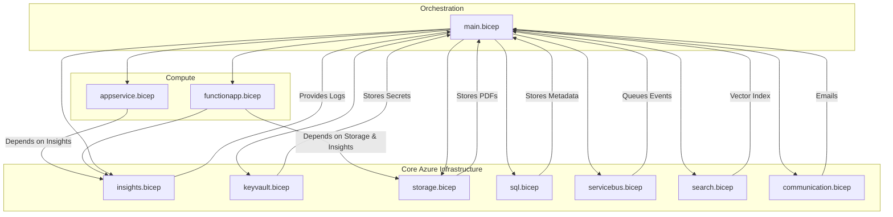

# DocuMind AI Infrastructure

This directory contains the production-ready Azure Bicep Infrastructure as Code (IaC) for DocuMind AI.

## Architecture

The architecture relies on a highly modular Bicep setup designed for security, scalability, and cost-efficiency (optimized for Microsoft for Startups).

- **`main.bicep`**: Orchestrator that stitches all modules together and manages outputs.
- **`modules/*.bicep`**: Individual, reusable components encapsulating Azure resources.
- **`parameters/*.bicepparam`**: Environment-specific configurations for Development (`dev`) and Production (`prod`).

### Resource Dependency Diagram



## Cost Estimate (Development - `dev.bicepparam`)

To optimize for Microsoft for Startups credits, the `dev` environment utilizes the following inexpensive but capable SKUs:

| Resource | SKU | Reason | Estimated Monthly Cost |
| :--- | :--- | :--- | :--- |
| **App Service Plan** | `B1` (Basic) | Supports Linux and Always On, sufficient for dev Node.js apps. | ~$13.14 |
| **Azure SQL Database** | `Basic` (5 DTUs) | Cheapest tier for relational metadata testing. | ~$4.99 |
| **Service Bus** | `Standard` | Required for topics/queues. Basic does not support queues properly for our use case. | ~$10.00 |
| **AI Search** | `Basic` | Cheapest tier that supports Vector Search effectively. | ~$73.73 |
| **Blob Storage** | `Standard_LRS` | Cheapest redundancy option for dev storage. | ~$2.00 (varies by usage) |
| **Key Vault / Logs** | `Standard` | Pay-per-operation/GB. | ~$2.00 (varies by usage) |
| **Total Estimated** | | | **~$105.86 / month** |

*Note: Production SKUs (`P1v3`, `Standard ZRS`) will scale costs up significantly for high availability and performance.*

## Security Implementations

1.  **No Hardcoded Secrets**: SQL passwords and Storage keys are securely injected into Azure Key Vault (`sqlSecret`, `storageSecret`) during deployment.
2.  **Managed Identities**: The Backend App and Azure Functions are assigned `SystemAssigned` identities. The backend app is automatically granted access policies to the Key Vault.
3.  **HTTPS/TLS**: Configured `httpsOnly: true` on App Services and `minimumTlsVersion: '1.2'` across Storage, Service Bus, and App Services.
4.  **Parameters**: Used `@secure()` decorators on passwords and connection strings.

## Deployment Instructions

### Validation Checklist

Before deploying, ensure you run the validation command.

- [ ] Azure CLI is installed and logged in (`az login`).
- [ ] You have selected the correct subscription (`az account set -s <sub-id>`).

### 1. Validate Deployment

Test the Bicep template without provisioning resources:

```bash
az group create --name rg-documind-ai --location eastus

az deployment group validate \
  --resource-group rg-documind-ai \
  --template-file infra/main.bicep \
  --parameters infra/parameters/dev.bicepparam
```

### 2. Create Deployment

Once validation passes, provision the infrastructure:

```bash
az deployment group create \
  --resource-group rg-documind-ai \
  --template-file infra/main.bicep \
  --parameters infra/parameters/dev.bicepparam
```

### 3. Review Outputs

After deployment, the terminal will output the values for:
*   `frontendAppUrl`
*   `backendAppUrl`
*   `functionAppUrl`
*   `sqlServerName`
*   `keyVaultName`

Use these to configure your local `.env` variables if running locally, or verify they match your expectations in the Azure Portal.
